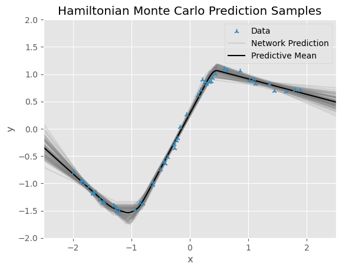
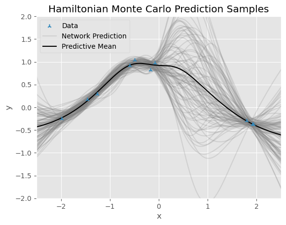

# Tiny Neural Nets

This repository exisits for two reasons:
1. I wanted to explore neural networks with a single hidden layer of very few units with ReLU activations; ideally few enough to "see" each ReLU in prediction space.
2. I wanted to have a go at implementing Hamiltonian and Langevin Monte Carlo MCMC schemes for inference in Bayesian neural networks (BNNs).

Both datasets were generated from Gaussian process prior samples with exponentiated negative quadratic covariance functions. In the notebooks you will see that to reach the prediction samples shown below, for each MCMC scheme there was a removal of earlier samples corresponding to a burn-in period, as well as a sample lag correlation investigation to figure out how much to thin the samples in order for them to be treated as independent. LMC is just a random walk, albeit one with highly desirable behaviour in high dimensions, and so to obtain a set of independent posterior samples we must simulate the Langevin diffusion for *very* many steps, and then thin the aquired chain quite heavily. HMC is more sophisticated, and so although it takes longer to obtain each succesive sample, successive samples can be almost entirely independent if the Hamiltonian dynamics simulation is long enough (i.e. enough leapfrog steps), and the posterior is explored much more quickly as a function of Markov chain length in comparison to LMC.

### Underparameterised Regime
Below are the predictions of a deterministic NN trained with Adam, a BNN with posterior samples obtained via Metropolis-adjusted Langevin Monte Carlo, and a BNN with posterior samples obtained via Hybrid/Hamiltonian Monte Carlo respectively. The networks all have one hidden layer of just three units, and ReLU activations are used throughout.

  
  
  

Notice how the characteristic "corners" of the seperate ReLU's can be seen, and also how relatively tight the BNN uncertainty bounds are in this underparameterised regime, since the abundance of relatively noiseless data leaves little uncertainty over the network weight values.

### Overparameterised Regime
Below are the predictions of the same three models but in a setting with much less data. The networks all have one hidden layer of 100 units, and Tanh activations are used at this point for smoother prediction samples.

  
  
  

