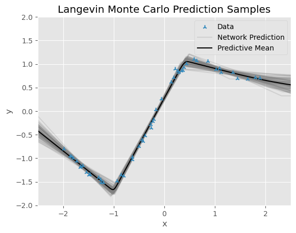

# Tiny Neural Nets

This repository exisits for two reasons:
1. I wanted to explore neural networks with a single hidden layer of very few units with ReLU activations; ideally few enough to "see" each ReLU in prediction space.
2. I wanted to have a go at implementing Hamiltonian and Langevin Monte Carlo MCMC schemes for inference in Bayesian neural networks (BNNs).

Both datasets were generated from Gaussian process prior samples with exponentiated quadratic covariance functions.

### Underparameterised Regime
Below are the predictions of a deterministic NN trained with Adam, a BNN with posterior samples obtained via Metropolis-adjusted Langevin Monte Carlo, and a BNN with posterior samples obtained via Hybrid/Hamiltonian Monte Carlo respectively. The networks all have one hidden layer of just three units, and ReLU activations are used throughout.

  
  
  

Notice how the characteristic "corners" of the seperate ReLU's can be seen, and also how relatively tight the BNN uncertainty bounds are in this underparameterised regime, since the abundance of relatively noiseless data leaves little uncertainty over the network weight values.

### Overparameterised Regime
Below are the predictions of the same three models but in a setting with much less data. The networks all have one hidden layer of 100 units, and Tanh activations are used at this point for smoother prediction samples.

  
  
  

Notice how in areas far from datapoints, the BNN prediction samples are more loosely scattered, implying a greater uncertainty over the underlying function that generated the data.
